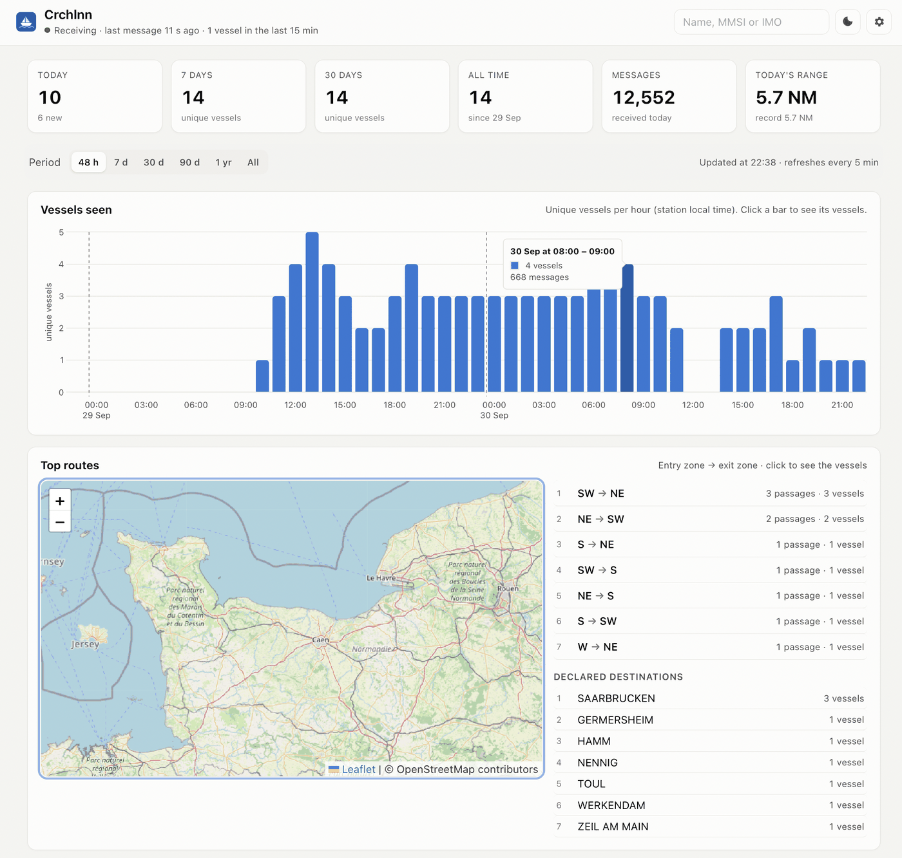
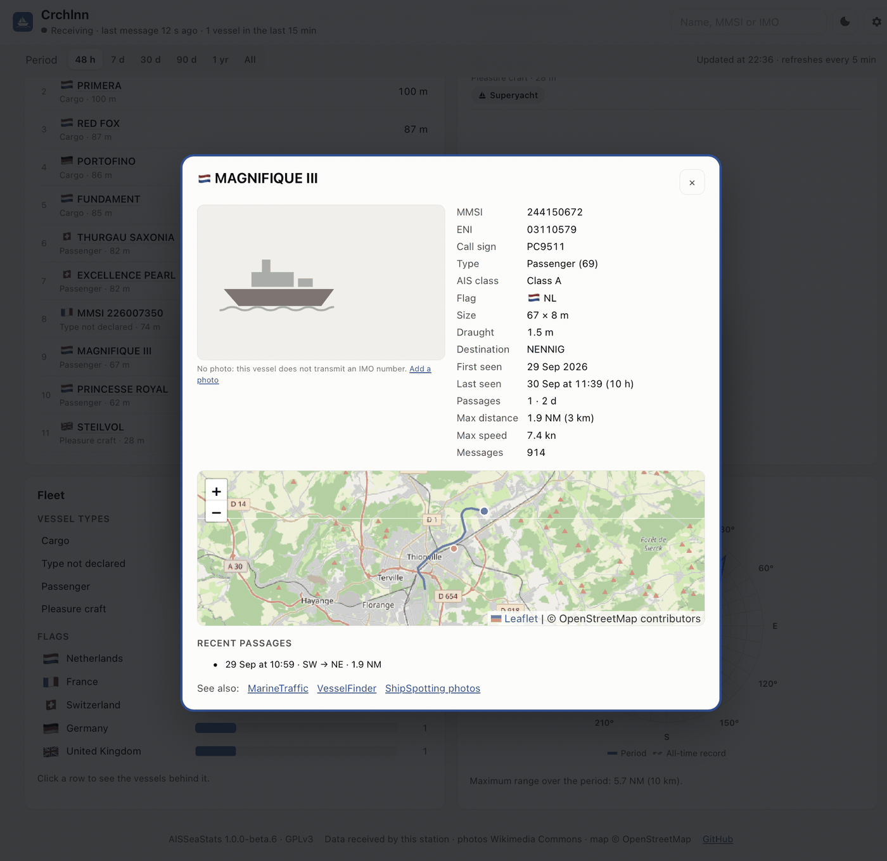
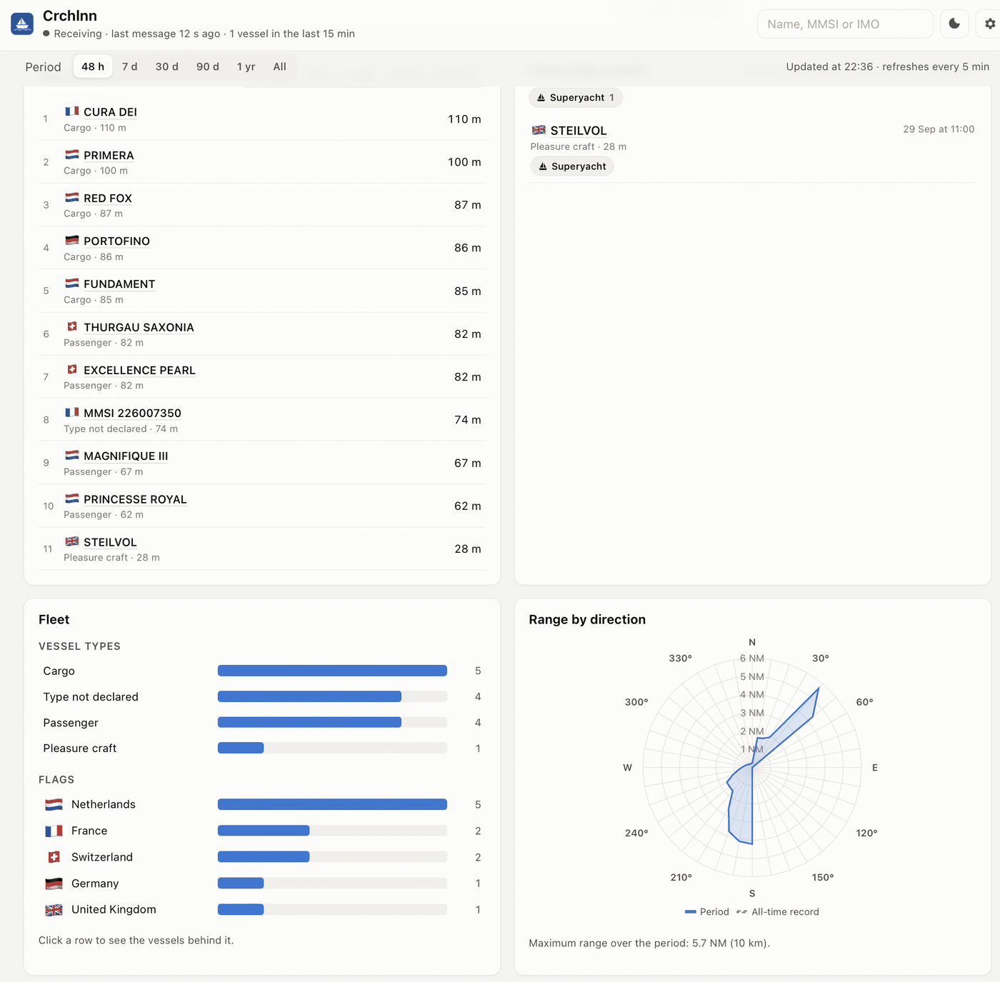
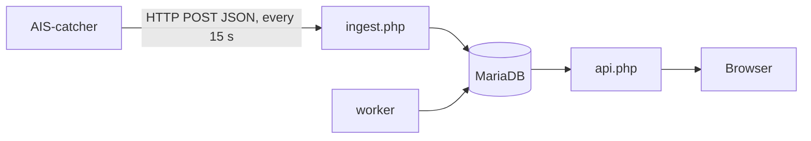
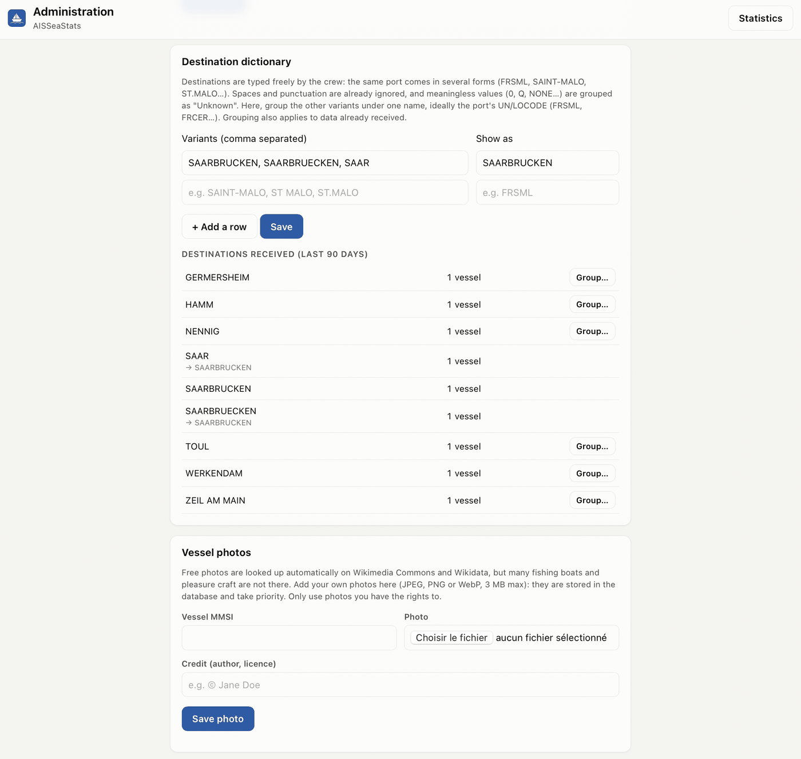
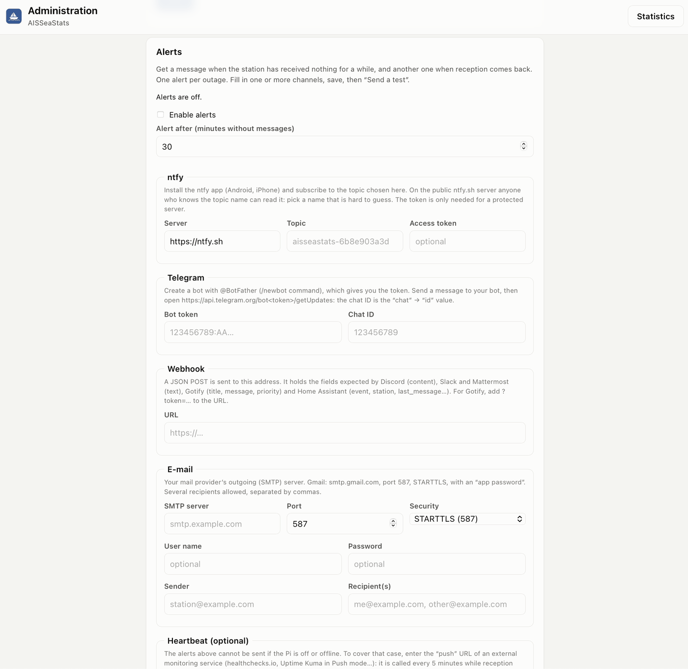

# AISSeaStats

Long-term statistics for your [AIS-catcher](https://github.com/jvde-github/AIS-catcher) station — the SkyStats idea, for ships.

AIS-catcher already shows a live map. AISSeaStats keeps the history and turns it into one simple page:

- **Vessels seen** per hour, day and month; click a bar to list them
- **Top routes**, inferred from where each vessel enters and leaves your coverage, drawn on a map
- **Top vessels** by passages, days seen, length, speed and distance
- **Interesting vessels**: military, authorities and rescue, superyachts, dangerous goods, very large ships, rare flags, your own watch list
- **Fleet** by type and flag, and **range by direction**
- A **vessel card** on click: photo (your own, or Wikimedia Commons), identity, size, first and last seen, recent passages, track, links to aiscatcher.org, VesselFinder and ShipSpotting
- **Alerts** when your station stops receiving: ntfy, Telegram, webhook or e-mail

French and English, light and dark themes, works on a phone. Runs next to AIS-catcher on a Raspberry Pi.

> Français : voir [docs/README.fr.md](docs/README.fr.md).



<p>
  
  
</p>

## How it works



AIS-catcher's built-in HTTP output (`-H`) posts decoded messages. AISSeaStats does not store every message: it updates counters, one sampled position per vessel per minute (kept 30 days by default), passages and range records. A year of statistics stays well under 1 GB.

## Requirements

| | Minimum | Recommended |
| --- | --- | --- |
| Host | 64-bit Linux: Raspberry Pi 4 or 5 with **Raspberry Pi OS 64-bit**, or any amd64 machine | Pi 4 (2 GB+) or Pi 5 |
| Memory available | 512 MB | 1 GB |
| Free disk space | 1 GB | 2 GB, ideally on an SSD rather than the SD card |
| Docker | Docker Engine with the Compose plugin (`docker compose`) | latest stable |
| AIS-catcher | 0.29 or newer, reachable over the network | latest |

32-bit systems (`armv7l`, `armv6l`) are not supported: the official MariaDB image is 64-bit only.

Check before installing:

```sh
uname -m                  # must print aarch64 or x86_64
docker compose version    # must print a version
free -h                   # "available" column
df -h .                   # "Avail" column
```

No Docker yet? `curl -fsSL https://get.docker.com | sh`, then `sudo usermod -aG docker $USER` and log in again.

`install.sh` runs these checks itself and stops with a clear message if something is missing.

## Install (Docker)

```sh
git clone https://github.com/Crchlnn/AISSeaStats.git
cd AISSeaStats
./install.sh
```

**Allow 5 to 10 minutes on a Raspberry Pi** for the first install (about 6.5 minutes measured on a Pi 4), 1 to 2 minutes on a PC: the image compiles PHP extensions once. Updates are much faster.

`install.sh` creates `.env` with random database passwords, builds the image and starts three containers: `db` (MariaDB 11), `app` (lighttpd + PHP-FPM) and `worker` (background jobs). Then open `http://<pi-address>:8095` and the setup wizard asks for:

1. the station name and antenna position (used for distances and range, never sent anywhere),
2. the time zone and language,
3. an admin password.

If AIS-catcher runs in managed mode, the wizard can pre-fill the name and position from its `config.json` (read in your browser, never uploaded). It then shows your **ingestion token** and how to fill AIS-catcher's HTTP output.

Manual alternative: `cp .env.example .env`, edit the passwords, then `docker compose up -d --build`.

## Connect AIS-catcher

### Managed mode (web interface)

In AIS-catcher: **Output → HTTP → add an output**, then:

| AIS-catcher field | Value |
| --- | --- |
| Description | anything, e.g. `AISSeaStats` |
| Link | empty |
| URL | `http://<pi-address>:8095/ingest.php` |
| Interval | `15` |
| ID | optional: station name, shown in the ingestion log |
| Credentials | `aisseastats:<token>` |
| Protocol | `AISCATCHER` (the default) |
| Gzip | on |
| Response | either way (on shows AISSeaStats' reply in the AIS-catcher log) |
| Unique / Downsample Position | off |

Keep **Active** on and **save with the floppy-disk icon** at the top right: while "You have unsaved changes" shows, nothing is applied.

### Command line or service

Add these options to your existing AIS-catcher command (do not run the line on its own):

```
-M DTM -H http://<pi-address>:8095/ingest.php interval 15 gzip on userpwd aisseastats:<token> id MyStation
```

`-M DTM` adds signal level, reception time and flag country to each message. Field reference: [AIS-catcher JSON decoding](https://jvde-github.github.io/AIS-catcher-docs/references/JSON-decoding/). Without it, the flag is derived from the MMSI and signal levels are not recorded.

### Which address?

AIS-catcher usually runs in its own Docker container, so `localhost` and `127.0.0.1` point to that container, not to AISSeaStats. Use:

- the Pi's IP address, e.g. `http://192.168.1.20:8095/ingest.php`, or
- its name from your local DNS (Pi-hole, router), **without `.local`**, e.g. `http://mypi:8095/ingest.php`.

Names ending in `.local` (mDNS/Bonjour) usually work in a browser but not inside Docker containers.

The first figures appear within a minute. Routes appear once vessels have left your coverage for 2 hours.

## Try it with demo data

```sh
docker compose exec app php bin/simulate.php --hours 72      # 72 h of fake traffic around your station
docker compose exec app php bin/reset-data.php --yes          # remove it before real use
```

## Upgrade

Your statistics are kept: they live in the Docker volume `aisseastats_db-data`, and your settings in the database and in `.env`, none of which Git or the upgrade touch. Database changes are applied automatically when the app starts.

```sh
cd AISSeaStats                       # the folder you installed from
git pull                             # get the new version
docker compose up -d --build         # rebuild and restart (a few seconds to a minute)
```

Then reload the page (Ctrl+F5 / Cmd+Shift+R if the look did not change). Check the version at the bottom of the page and what changed in [Version history](#version-history).

- **Backup first, if you want to be safe** (see the table below): an upgrade does not delete data, but a backup costs nothing.
- **`git pull` refuses to run** ("your local changes would be overwritten"): you edited a tracked file. `git stash`, then `git pull`, then `git stash pop` if you want your change back; your data is not affected.
- **Going back to a previous version**: `git checkout v1.0.0-beta.3` (for example), then `docker compose up -d --build`. Database changes are not rolled back, so prefer restoring a backup taken before the upgrade.
- Only `docker compose down -v` deletes the data (the `-v` removes the volume).

## Version history

Newest first. Details, fixes and database changes for each version: [CHANGELOG.md](CHANGELOG.md) (English) · [docs/CHANGELOG.fr.md](docs/CHANGELOG.fr.md) (français).

| Version | Date | What's new |
|---|---|---|
| 1.0.0-beta.8 | 2026-10-06 | Debug capture also written to a dated JSON Lines file (contributed by @Phil353556); aiscatcher.org link on the vessel card instead of MarineTraffic, whose links no longer work |
| 1.0.0-beta.7 | 2026-09-30 | Debug capture of raw messages in the admin; explanation when a vessel's name has not been received; 30/90-day charts always show the whole period |
| 1.0.0-beta.6 | 2026-09-30 | Alerts when reception stops, and when it comes back: ntfy, Telegram, webhook (Discord, Slack, Gotify, Home Assistant…) and e-mail, with a test button; optional heartbeat URL to detect a station that is off; type of inland vessels from Inland AIS data; clearer database size in the admin |
| 1.0.0-beta.5 | 2026-09-30 | Destination dictionary in the admin (e.g. `SAINT-MALO, ST-MALO, FR SML` → `FRSML`); meaningless destinations (`0`, `Q`…) shown as *Unknown*; click a bar of the vessel chart to list its vessels; maximum range raised to 1,500 NM by default (tropospheric ducting), with far positions confirmed before they set a record |
| 1.0.0-beta.4 | 2026-09-30 | One period selector for the whole page, remembered; automatic refresh; click a type, flag, route or destination to list its vessels; readable fleet bars on phones; your own vessel photos, then Wikimedia Commons / Wikidata; setup pre-filled from AIS-catcher's `config.json`; fixes for map tiles "Access blocked" and empty charts |
| 1.0.0-beta.3 | 2026-09-29 | Flag derived from the MMSI; "rare flag" only once 100 vessels are known; clearer AIS-catcher instructions |
| 1.0.0-beta.2 | 2026-09-29 | Fix for "Invalid form token" in Docker; install time documented; memory and disk checks in `install.sh` |
| 1.0.0-beta.1 | 2026-09-29 | First test version |

## Everyday commands

| Task | Command |
| --- | --- |
| Upgrade | `git pull && docker compose up -d --build` |
| Logs | `docker compose logs -f app worker` |
| Status | `docker compose ps` |
| Lost admin password | `docker compose exec app php bin/reset-admin.php` |
| Backup | `docker compose exec db sh -c 'mariadb-dump -u root -p"$MARIADB_ROOT_PASSWORD" aisseastats' \| gzip > aisseastats.sql.gz` |
| Restore a backup | `gunzip -c aisseastats.sql.gz \| docker compose exec -T db sh -c 'mariadb -u root -p"$MARIADB_ROOT_PASSWORD" aisseastats'` |
| Uninstall (keeps data) | `docker compose down` |
| Uninstall and delete data | `docker compose down -v` |

## Admin page

`http://<pi-address>:8095/admin.php`: ingestion health, station settings, rules for interesting vessels, named zones for routes, destination dictionary, alerts, vessel photos, token rotation, password, deletion of one vessel's data or of everything.

**Named zones** make routes readable. By default a route goes from one compass sector around the station to another (`SW → NE`). Add zones such as a lock, a port or a town and routes become `Harbour → North lock`. Existing passages are recomputed when zones change.

**Destination dictionary.** Crews type the destination freely: `FRSML`, `FR SML`, `SAINT-MALO`, `ST-MALO`… Group the spellings of a port under one name (for example `SAINT-MALO, ST-MALO, FR SML` → `FRSML`). The admin lists the destinations received in the last 90 days to help. Meaningless values such as `0` or `Q` are shown as *Unknown*.



**Maximum plausible range** (1,500 NM by default): tropospheric ducting can bring messages from over 1,000 NM. Beyond 50 NM, a position only counts for range records when the same vessel was received shortly before at a consistent position, so a single corrupted message cannot set a record.

## Alerts

AIS-catcher does not tell you when reception stops. AISSeaStats can: in the admin, **Alerts** sends one message when nothing has been received for N minutes (30 by default), and another when reception comes back. Channels, any combination:

- **ntfy**: the ntfy app on your phone, with the public ntfy.sh server or your own. Pick a topic name that is hard to guess.
- **Telegram**: a bot created with @BotFather, its token and your chat ID.
- **Webhook**: a JSON POST readable by Discord, Slack, Mattermost, Gotify, Home Assistant or n8n.
- **E-mail**: through your provider's SMTP server (STARTTLS or SSL/TLS).

“Send a test” checks each channel and shows the error if one fails. These alerts are sent by the Pi itself, so they cannot warn you if the Pi is off or offline: for that, give a **heartbeat** URL (healthchecks.io, Uptime Kuma in Push mode…), called every 5 minutes while reception works.



## Photos

The vessel card shows, in this order:

1. **your own photo**, added in the admin page (Vessel photos) or from the card's "Add a photo" link when signed in as admin; it is stored in the database;
2. a free photo from [Wikimedia Commons](https://commons.wikimedia.org/), found by IMO number (files categorised `IMO nnnnnnn`);
3. the image of the matching [Wikidata](https://www.wikidata.org/) item, found by IMO number (P458) or MMSI (P587).

Free photos are shown with author and licence and cached 30 days. Many fishing boats and pleasure craft have no free photo anywhere: they get a silhouette, and you can add yours. VesselFinder, ShipSpotting and aiscatcher.org are **linked, never fetched**: their terms do not allow automated reuse of their photos. The Wikimedia/Wikidata look-up is the only outbound call and can be turned off in the admin.

## Troubleshooting

| Symptom | Fix |
| --- | --- |
| "Waiting for the first data from AIS-catcher" | Check the HTTP output is **saved** and **Active** in AIS-catcher, and that its URL uses the Pi's IP or DNS name (not `localhost`, not `.local`). The admin page shows the last batch received and the last error. |
| Admin shows "token rejected" | The credentials in AIS-catcher do not match: generate a new token in the admin and paste `aisseastats:<token>` again. |
| Map tiles show "Access blocked" | Upgrade to 1.0.0-beta.4 or later (the page now sends the Referer that OpenStreetMap requires), or set another tile server in the admin. |
| A chart stays empty after switching period | Upgrade to 1.0.0-beta.4 or later, then reload the page. |
| A vessel has an MMSI but no name | The name only comes in the vessel's identity message (AIS type 5, or 24 for class B), sent every 6 minutes and longer than a position report, so it is the first lost at the edge of range. In the admin, **Debug: received messages** records what AIS-catcher sends for that MMSI and shows which message types arrive. |
| The admin shows a few MB of data but the database folder takes over 100 MB | Normal. The admin shows the statistics themselves; MariaDB's folder also holds fixed-size files, mainly its 96 MB transaction log. Only the data part grows over time. |

## Security

- Designed for a home network. Do not expose it to the Internet without a reverse proxy with authentication and TLS.
- Ingestion requires the token (HTTP Basic or Bearer), compared in constant time; payload size is capped; every query is parameterised.
- The stats page is read-only. The admin uses a hashed password, CSRF tokens and `SameSite=Strict` cookies. A strict Content-Security-Policy is sent; JavaScript libraries are bundled.
- Complete the setup wizard right after installing: until then, anyone on your network could do it.
- `INGEST_ALLOW` in `.env` can restrict ingestion to given networks.
- Radio reception and redistribution of AIS data depend on local regulations.

## Development

```sh
php tests/run.php                                         # unit tests
DB_HOST=127.0.0.1 DB_NAME=test DB_USER=… DB_PASSWORD=… php tests/run.php   # + integration tests
```

Stack: PHP 8.3 without framework, MariaDB, vanilla JavaScript with [Chart.js](https://www.chartjs.org/) and [Leaflet](https://leafletjs.com/) bundled in `public/assets/vendor`. Scoping notes: [docs/CADRAGE.md](docs/CADRAGE.md).

## Licence

GPL-3.0-or-later, see [LICENSE](LICENSE). Bundled: Chart.js (MIT), Leaflet (BSD-2-Clause).
AISSeaStats is not affiliated with AIS-catcher. Not for navigation.
