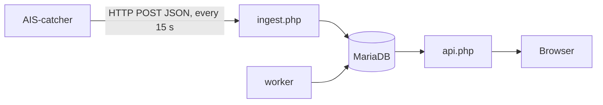

# AISSeaStats

Long-term statistics for your [AIS-catcher](https://github.com/jvde-github/AIS-catcher) station — the SkyStats idea, for ships.

AIS-catcher already shows a live map. AISSeaStats keeps the history and turns it into one simple page:

- **Vessels seen** per hour, day and month
- **Top routes**, inferred from where each vessel enters and leaves your coverage, drawn on a map
- **Top vessels** by passages, days seen, length, speed and distance
- **Interesting vessels**: military, authorities and rescue, superyachts, dangerous goods, very large ships, rare flags, your own watch list
- **Fleet** by type and flag, and **range by direction**
- A **vessel card** on click: photo (Wikimedia Commons), identity, size, first and last seen, recent passages, track, links to MarineTraffic and VesselFinder

French and English, light and dark themes, works on a phone. Runs next to AIS-catcher on a Raspberry Pi.

> Français : voir [docs/README.fr.md](docs/README.fr.md).

## How it works



AIS-catcher's built-in HTTP output (`-H`) posts decoded messages. AISSeaStats does not store every message: it updates counters, one sampled position per vessel per minute (kept 30 days by default), passages and range records. A year of statistics stays well under 1 GB.

## Requirements

| | Minimum | Recommended |
| --- | --- | --- |
| Host | 64-bit Linux: Raspberry Pi 4 or 5 with **Raspberry Pi OS 64-bit**, or any amd64 machine | Pi 4 (2 GB+) or Pi 5 |
| Memory available | 512 MB | 1 GB |
| Free disk space | 1 GB | 2 GB, ideally on an SSD rather than the SD card |
| Docker | Docker Engine with the Compose plugin (`docker compose`) | latest stable |
| AIS-catcher | 0.29 or newer, reachable over the network | latest |

32-bit systems (`armv7l`, `armv6l`) are not supported: the official MariaDB image is 64-bit only.

Check before installing:

```sh
uname -m                  # must print aarch64 or x86_64
docker compose version    # must print a version
free -h                   # "available" column
df -h .                   # "Avail" column
```

No Docker yet? `curl -fsSL https://get.docker.com | sh`, then `sudo usermod -aG docker $USER` and log in again.

`install.sh` runs these checks itself and stops with a clear message if something is missing.

## Install (Docker)

```sh
git clone https://github.com/Crchlnn/AISSeaStats.git
cd AISSeaStats
./install.sh
```

**Allow 5 to 10 minutes on a Raspberry Pi** for the first install (about 6.5 minutes measured on a Pi 4), 1 to 2 minutes on a PC: the image compiles PHP extensions once. Updates are much faster.

`install.sh` creates `.env` with random database passwords, builds the image and starts three containers: `db` (MariaDB 11), `app` (lighttpd + PHP-FPM) and `worker` (background jobs). Then open `http://<pi-address>:8095` and the setup wizard asks for:

1. the station name and antenna position (used for distances and range, never sent anywhere),
2. the time zone and language,
3. an admin password.

It then shows your **ingestion token** and the line to add to AIS-catcher.

Manual alternative: `cp .env.example .env`, edit the passwords, then `docker compose up -d --build`.

## Connect AIS-catcher

Command line or service configuration:

```
AIS-catcher ... -M DTM -H http://<pi-address>:8095/ingest.php interval 15 gzip on userpwd aisseastats:<token> id MyStation
```

- `-M DTM` adds signal level, reception time and flag country to each message. Without it, the flag is derived from the MMSI and signal levels are not recorded.
- In AIS-catcher's managed mode (web interface), add an **HTTP output** with the same URL, `userpwd`, interval 15 and gzip on.

The first figures appear within a minute. Routes appear once vessels have left your coverage for 2 hours.

## Try it with demo data

```sh
docker compose exec app php bin/simulate.php --hours 72      # 72 h of fake traffic around your station
docker compose exec app php bin/reset-data.php --yes          # remove it before real use
```

## Everyday commands

| Task | Command |
| --- | --- |
| Update | `git pull && docker compose up -d --build` |
| Logs | `docker compose logs -f app worker` |
| Status | `docker compose ps` |
| Lost admin password | `docker compose exec app php bin/reset-admin.php` |
| Backup | `docker compose exec db sh -c 'mariadb-dump -u root -p"$MARIADB_ROOT_PASSWORD" aisseastats' \| gzip > aisseastats.sql.gz` |
| Uninstall (keeps data) | `docker compose down` |
| Uninstall and delete data | `docker compose down -v` |

## Admin page

`http://<pi-address>:8095/admin.php`: ingestion health, station settings, rules for interesting vessels, named zones for routes, token rotation, password, deletion of one vessel's data (GDPR requests) or of everything.

**Named zones** make routes readable. By default a route goes from one compass sector around the station to another (`SW → NE`). Add zones such as a lock, a port or a town and routes become `Harbour → North lock`. Existing passages are recomputed when zones change.

## Photos

Photos come from [Wikimedia Commons](https://commons.wikimedia.org/), looked up by IMO number (Commons files are categorised as `IMO nnnnnnn`), shown with author and licence, and cached 30 days. Vessels without an IMO number (many inland and pleasure craft) get a silhouette. MarineTraffic and similar services are linked, not scraped: their terms do not allow it. The lookup is the only outbound call and can be turned off in the admin.

## Security and privacy

- Designed for a home network. Do not expose it to the Internet without a reverse proxy with authentication and TLS.
- Ingestion requires the token (HTTP Basic or Bearer), compared in constant time; payload size is capped; every query is parameterised.
- The stats page is read-only. The admin uses a hashed password, CSRF tokens and `SameSite=Strict` cookies. A strict Content-Security-Policy is sent; JavaScript libraries are bundled.
- Complete the setup wizard right after installing: until then, anyone on your network could do it.
- `INGEST_ALLOW` in `.env` can restrict ingestion to given networks.
- An MMSI can identify a private boat owner, so the history of passages can be personal data. Keep the page private, and use the admin to delete a vessel's data on request. Radio reception and redistribution of AIS data depend on local regulations.

## Development

```sh
php tests/run.php                                         # unit tests
DB_HOST=127.0.0.1 DB_NAME=test DB_USER=… DB_PASSWORD=… php tests/run.php   # + integration tests
```

Stack: PHP 8.3 without framework, MariaDB, vanilla JavaScript with [Chart.js](https://www.chartjs.org/) and [Leaflet](https://leafletjs.com/) bundled in `public/assets/vendor`. Scoping notes: [docs/CADRAGE.md](docs/CADRAGE.md).

## Licence

GPL-3.0-or-later, see [LICENSE](LICENSE). Bundled: Chart.js (MIT), Leaflet (BSD-2-Clause).
AISSeaStats is not affiliated with AIS-catcher. Not for navigation.
