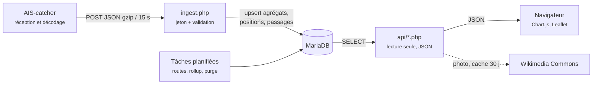
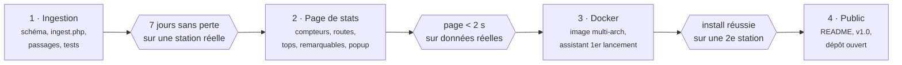

# AISSeaStats — Note de cadrage

*Version 2.1 — 29 septembre 2026 (mise à jour à la livraison de la 1.0.0-beta.1)*

AISSeaStats est une page web de statistiques longue durée pour les stations [AIS-catcher](https://github.com/jvde-github/AIS-catcher), dans l'esprit de SkyStats côté ADS-B. Distribution **Docker d'abord**, licence **GPLv3**.

## 1. Décisions prises

| Sujet | Décision |
| --- | --- |
| Nom | AISSeaStats — dépôt [Crchlnn/AISSeaStats](https://github.com/Crchlnn/AISSeaStats) |
| Licence | GPLv3 |
| Ingestion | Option A : push HTTP natif d'AIS-catcher (`-H`) vers `ingest.php`, stockage MariaDB |
| Distribution | Docker Compose en premier ; installation native (`install.sh`) plus tard |
| Serveur web | lighttpd + PHP-FPM (dans le conteneur, et par défaut en natif) |
| Traces de navires | Dès la v1.0 |
| Unités | Milles nautiques (NM) par défaut, km affichés en second |
| Contact mainteneur AIS-catcher | Prévu, pour présenter le projet à la communauté AIS-catcher |

**Séquence de test** : une première station en Docker (installer et lancer), une seconde station côtière à fort trafic, puis ouverture publique.

## 2. Contexte

AIS-catcher sait déjà historiser (sortie `-D` vers SQLite/PostgreSQL, Prometheus), mais aucun outil n'offre une page de stats clé en main. AISSeaStats comble ce vide : une application légère sur le même Pi que le récepteur, qui transforme le flux AIS-catcher en statistiques lisibles sur des mois.

## 3. Périmètre v1.0

Une application d'une page principale, simple, avec une fenêtre navire en surimpression.

| Bloc | Contenu v1.0 |
| --- | --- |
| **Compteurs de navires** | Navires uniques par heure, jour, mois (graphiques) ; totaux aujourd'hui / 7 j / 30 j / depuis le début ; nouveaux navires du jour |
| **Top routes** | Routes les plus fréquentes (voir §5), tracées sur une carte, avec nombre de passages et sens |
| **Top navires** | Navires les plus vus (passages, jours de présence), plus longs, plus rapides, plus lointains |
| **Navires remarquables** | Liste des derniers navires « intéressants » selon des règles (voir §6), avec date de passage |
| **Portée** | Portée max par jour et diagramme polaire par secteur de 10° |
| **Fenêtre navire** | Au clic sur un nom : photo, identité, dimensions, pavillon, première/dernière vue, nombre de passages, dernière destination, trace récente sur mini-carte, liens externes (voir §7) |

Transverse : FR/EN, thème clair et sombre, responsive mobile, fuseau configurable.

**Reporté en v1.1+** : export CSV, stats de signal, notifications, multi-station, mode public anonymisé complet.

**Hors périmètre** : carte temps réel (le web viewer d'AIS-catcher le fait), envoi vers les agrégateurs, ADS-B.

## 4. Ingestion

AIS-catcher poste toutes les 15 s un lot JSON décodé vers `ingest.php` :

```
AIS-catcher ... -M DTM -H http://<ip-du-pi>:8095/ingest.php interval 15 gzip on userpwd aisseastats:<jeton> id MaStation
```

`-M DTM` ajoute le signal, l'horodatage de réception et le pays du pavillon. En mode « managed », la même sortie se règle dans l'interface d'AIS-catcher ; l'assistant de premier lancement d'AISSeaStats affiche la ligne exacte à copier.

## 5. Définition des routes

L'AIS ne transmet pas d'origine, et la destination est saisie à la main par l'équipage (souvent vide, surtout en fluvial). Une route est donc **déduite des positions** :

1. **Passage** : présence continue d'un MMSI ; un silence de plus de 2 h clôt le passage.
2. **Point d'entrée et de sortie** : première et dernière position du passage, rattachées à une **zone**.
3. **Zones** : par défaut 8 secteurs de 45° autour de la station (N, NE, E…) ; l'utilisateur peut définir ses propres zones nommées (ex. une écluse, un port, une ville en amont ou en aval).
4. **Route** = couple zone d'entrée → zone de sortie. « Top routes » classe ces couples par nombre de passages, tracés sur la carte avec une ligne moyenne.
5. En complément : **top destinations déclarées**, normalisées (majuscules, UN/LOCODE quand présent).

Une station fluviale verra naturellement des routes « amont → aval » et l'inverse ; une station côtière verra des couloirs de navigation.

## 6. Navires remarquables

Règles v1.0, toutes activables et modifiables dans l'administration :

| Catégorie | Règle de détection |
| --- | --- |
| Militaire | Type AIS 35 (opérations militaires) ; liste de préfixes MMSI connus configurable |
| Forces de l'ordre / secours | Types 51 (SAR), 55 (police), 58 (transport médical) ; aéronefs SAR (message type 9) |
| Grande plaisance (yachts de luxe) | Type 37 ou 36 et longueur ≥ 24 m |
| Matières dangereuses | Types 71-74 et 81-84 (catégories A à D) |
| Grande taille | Longueur ≥ seuil configurable (défaut 200 m, ou 110 m en mode fluvial) |
| Rareté | Premier passage jamais vu, pavillon vu moins de 3 fois |
| Liste de surveillance | MMSI ou noms saisis par l'utilisateur |

Limite connue : l'AIS n'a pas de type « yacht de luxe » ni « militaire » fiable ; certains navires militaires n'émettent pas ou se déclarent autrement. La détection est donc indicative.

## 7. Photos et données externes

**MarineTraffic n'est pas utilisable comme source directe** : son API est payante et ses conditions interdisent la récupération automatisée des pages et photos. Même chose pour VesselFinder et ShipSpotting.

Approche retenue :

| Élément | Source |
| --- | --- |
| Photo | [Wikimedia Commons](https://commons.wikimedia.org/) : recherche par catégorie « IMO nnnnnnn », puis par nom ; licence et auteur affichés sous la photo ; résultat mis en cache localement 30 jours |
| Photo absente | Silhouette générique selon le type de navire (fréquent pour les bateaux fluviaux et la plaisance, sans IMO) |
| Données | Tout ce que l'AIS fournit, stocké dans notre base (nom, indicatif, IMO, ENI fluvial, dimensions, type, pavillon, destination) |
| Pour aller plus loin | Liens sortants vers MarineTraffic, VesselFinder et MyShipTracking construits à partir du MMSI ou de l'IMO (simples liens, autorisés) |

L'appel à Wikimedia est le seul accès réseau sortant de l'application ; il est désactivable dans l'administration.

## 8. Architecture

PHP 8.3 sans framework, MariaDB 11, JavaScript natif avec Chart.js et Leaflet embarqués, lighttpd + PHP-FPM.



**Docker Compose** : trois conteneurs, une seule image applicative.

| Conteneur | Image | Rôle |
| --- | --- | --- |
| `app` | construite depuis le dépôt (`php:8.3-fpm-alpine` + lighttpd) ; plus tard `ghcr.io/crchlnn/aisseastats` | page de stats, API, ingestion |
| `worker` | même image, commande `worker` | tâches de fond chaque minute : routes, règles, agrégats, purge |
| `db` | `mariadb:11` officielle | base, volume persistant |

Port exposé par défaut : **8095** (évite 8080/8100/8118 déjà utilisés par les piles ADS-B et AIS-catcher), configurable.

**Arborescence du dépôt**

```
AISSeaStats/
├── public/            # racine web : index.php, ingest.php, api/, assets/
├── src/               # PHP : Ingest, Passages, Routes, Rules, Enrich, Geo, Repository
├── sql/migrations/    # appliquées automatiquement au démarrage
├── bin/               # routes.php, rollup.php, purge.php, migrate.php
├── docker/            # Dockerfile, lighttpd.conf, php-fpm, crontab
├── lang/              # fr.json, en.json
├── tests/             # PHPUnit + fixtures JSON anonymisées
├── docs/
├── docker-compose.yml · .env.example
└── README.md · LICENSE · CADRAGE.md · CHANGELOG.md · SECURITY.md
```

## 9. Modèle de données

| Table | Grain | Rétention |
| --- | --- | --- |
| `vessel` | 1 ligne par MMSI (identité, dimensions, pavillon, première/dernière vue, compteurs, record distance/vitesse) | permanente |
| `stats_hourly` | heure : messages, navires uniques, portée max | permanente |
| `vessel_hourly` / `vessel_daily` | présence par MMSI | 35 jours / permanente |
| `position` | MMSI × minute (lat, lon, cap, vitesse) | 30 jours, configurable |
| `passage` | 1 ligne par passage : début, fin, zone d'entrée, zone de sortie, distance max | permanente |
| `route_stats` | couple de zones : nombre de passages, dernière vue | permanente |
| `zone` | zones nommées ou secteurs par défaut | permanente |
| `rule` / `vessel_flag` | règles « remarquables » et navires marqués | permanente |
| `range_polar` | jour × secteur de 10° | permanente |
| `enrich_cache` | photo et métadonnées Commons par IMO/MMSI | 30 jours |
| `setting`, `ingest_log` | configuration, journal des lots | permanente / 7 jours |

Qualité : positions sentinelles ignorées, positions au-delà d'une portée plausible (défaut 1 500 NM, la propagation troposphérique peut dépasser 1 000 NM) ignorées, au-delà de 50 NM une position ne compte pour les records de portée que si elle est confirmée par une position précédente cohérente du même navire, sauts de position invraisemblables rejetés, sortie HTML toujours échappée.

Volumétrie indicative : positions à 1 par minute et par navire sur 30 jours = quelques centaines de Mo au plus ; le reste sous 100 Mo par an.

## 10. Installation (mode utilisateur, Docker)

Tant que le dépôt est privé :

```
git clone https://github.com/Crchlnn/AISSeaStats.git
cd AISSeaStats
./install.sh
```

`install.sh` crée `.env` avec des mots de passe aléatoires et lance `docker compose up -d --build`. Puis `http://<ip-du-pi>:8095` : l'assistant de premier lancement demande le nom et la position de la station, crée le compte admin, génère le jeton et affiche la ligne `-H` à ajouter dans AIS-catcher. Mise à jour : `git pull && docker compose up -d --build` (migrations automatiques).

Une fois public, le workflow `release.yml` publiera l'image multi-arch sur GHCR à chaque étiquette `v*`, ce qui permettra une installation sans compilation.

Prérequis : OS 64 bits (l'image officielle MariaDB n'existe pas en armv7).

## 11. Sécurité

- `ingest.php` : POST uniquement, jeton comparé à temps constant, taille de lot plafonnée, JSON validé, requêtes préparées.
- Interface en lecture seule ; administration protégée par mot de passe haché, CSRF, cookies `HttpOnly` + `SameSite=Strict`.
- CSP stricte, bibliothèques JS embarquées ; seules exceptions : tuiles de carte (OpenStreetMap, URL configurable) et Wikimedia (désactivable).

## 12. Planning



## 13. Risques

| Risque | Parade |
| --- | --- |
| Format JSON d'AIS-catcher qui évolue | Champs inconnus ignorés, fixtures de plusieurs versions |
| Routes peu parlantes avec les secteurs par défaut | Zones nommées éditables, assistant qui propose des zones à partir des traces |
| Peu de photos (fluvial, plaisance sans IMO) | Silhouettes par type, liens externes |
| Faux positifs « militaire » ou « luxe » | Règles éditables, libellé « indicatif » |
| Usure de la carte SD | Écritures par lots, `innodb_flush_log_at_trx_commit=2`, doc SSD USB |

## Sources

- [AIS-catcher — sortie HTTP](https://jvde-github.github.io/AIS-catcher-docs/configuration/output/HTTP/)
- [AIS-catcher — format JSON](https://jvde-github.github.io/AIS-catcher-docs/references/JSON-decoding/)
- [AIS-catcher — sortie base de données](https://jvde-github.github.io/AIS-catcher-docs/configuration/output/PSQL/)
- [AIS-catcher — web viewer et API](https://jvde-github.github.io/AIS-catcher-docs/configuration/output/web-viewer/)
